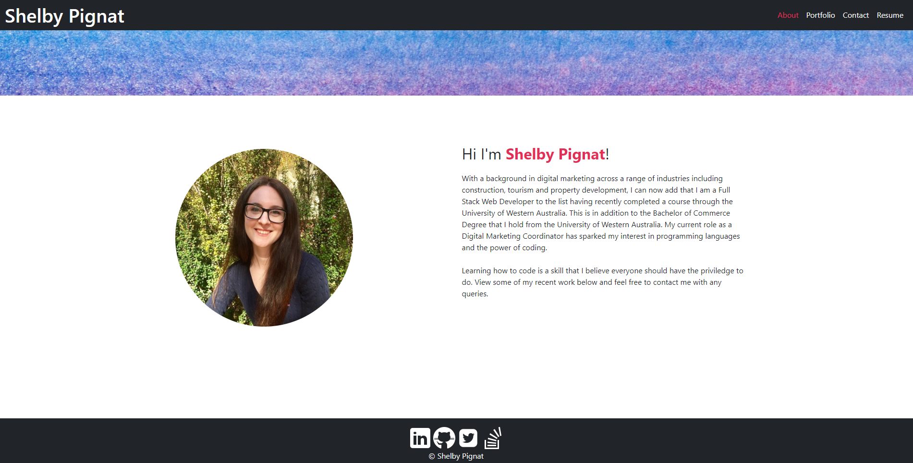
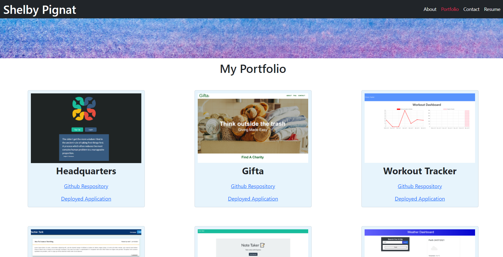
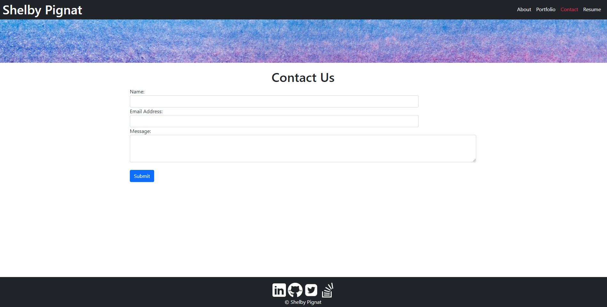
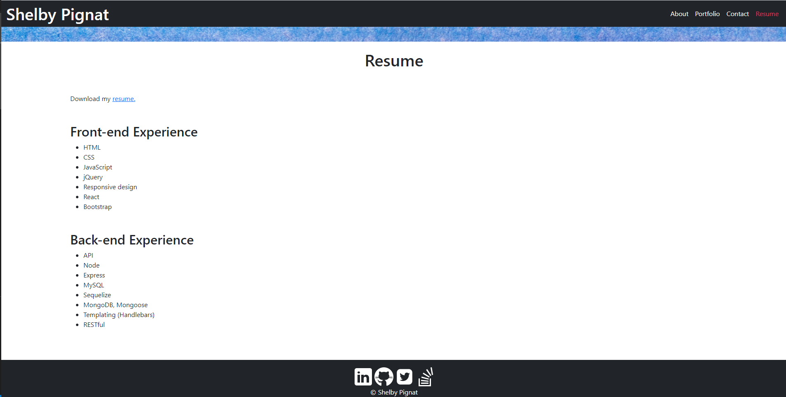

# 20 React: React Portfolio

[](https://opensource.org/licenses/MIT)

## Description

Any employer is able to view projects that I have worked on or created and successfully view deployed projects. Each of the project examples in this portfolio link to a live application. This application was created using React and Bootstrap.

Link to my portfolio: [view my portfolio](https://shelbyrp.github.io/react-portfolio/).






## Table of Contents

- [Installation](#installation)
- [Usage](#usage)
- [License](#license)
- [Contributing](#contributing)
- [Credits](#credits)
- [Tests](#tests)
- [Questions](#questions)

## Installation

Clone these files from the GitHub repository via your preferred means. Then make sure to install necessary dependencies by running the following commands:

```
npm init
```

```
npm install
```

This application can be view via the deployed link.

## Usage

Once the files have been pull down to your preferred repository, run this application by inputting 'npm start'or 'yarn start' into your bash terminal. The server will start. You can then view the application in the default browser.

Alternatively, you can use the application on the deployed link.

## License

This project is licensed by the [MIT](https://opensource.org/licenses/MIT) license

## Contributing

If any of the project I have worked on are of interest to you, please contact me with a detailed description of how you would like to contribute prior to any pull requests.

## Credits

https://reactjs.org/docs/

https://getbootstrap.com/docs/5.0/getting-started/introduction/

## Tests

There are currently no tests for this application.

## Questions

If you have any questions or require further clarification then please contact me at:

- https://github.com/Shelbyrp/
- shelby.pignat@gmail.com
